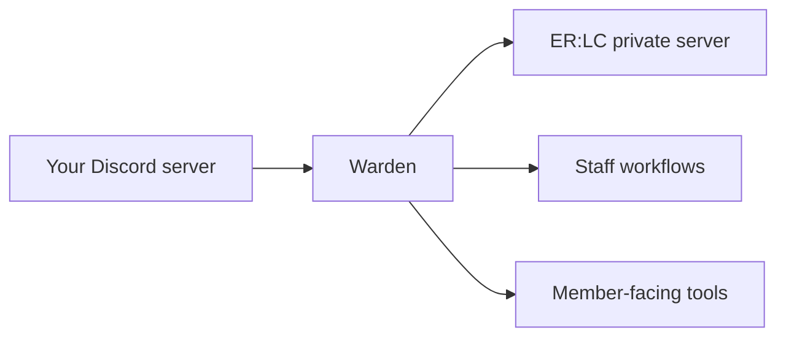

  Built for ease of use
  <h1 className="warden-hero-title">
    Run your ER:LC server like a <em>fortress.</em>
  </h1>
  

    Warden connects Discord to your ER:LC private server — moderation, verification,
    shift logging, sessions, infractions, applications, and live logs in one place.
  

  

    

      50+
      Servers
    

    

      3.5K+
      Users reached
    

    

      8
      Modules
    

  

<Card title="Invite Warden" icon="discord" href="https://discord.com/oauth2/authorize?client_id=1506630562113130657">
  Add Warden to your server, then open **`/config`** to turn on the modules you need.
</Card>

## Choose your path

<CardGroup cols={3}>
  <Card title="First-time setup" icon="rocket" href="/configuration/getting-started">
    Invite the bot, assign roles, and link your ER:LC API key.
  </Card>
  <Card title="Configure modules" icon="sliders" href="/modules/configuration">
    Every setting lives in Discord — no external dashboard.
  </Card>
  <Card title="Command lookup" icon="book" href="/configuration/commands">
    See what each staff tier can run at a glance.
  </Card>
</CardGroup>

## Built for ER:LC servers

Warden is designed around how ER:LC communities actually operate: in-game moderation from Discord, live server telemetry, session announcements, and internal staff tooling in one place.

## Feature areas

<Tabs>
  <Tab title="In-game & live ops">
    <CardGroup cols={2}>
      <Card title="Roblox Moderation" icon="gavel" href="/modules/roblox-moderation">
        Warn, kick, and ban players without opening the in-game mod panel.
      </Card>
      <Card title="ER:LC Server Logs" icon="wave-pulse" href="/modules/erlc-logs">
        Pipe joins, kills, modcalls, and commands into Discord channels.
      </Card>
      <Card title="Sessions" icon="megaphone" href="/modules/sessions">
        Poll, start, and announce roleplay sessions with custom embeds.
      </Card>
      <Card title="ER:LC integration" icon="plug" href="/configuration/erlc-integration">
        Connect your private server API key — required for the modules above.
      </Card>
    </CardGroup>
  </Tab>
  <Tab title="Staff & accountability">
    <CardGroup cols={2}>
      <Card title="Shift Logging" icon="timer" href="/modules/shift-logging">
        Clock in/out, enforce quotas, and see who is on duty right now.
      </Card>
      <Card title="Infractions" icon="clipboard-list" href="/modules/infractions">
        Record staff discipline with optional management approval.
      </Card>
      <Card title="Staff Feedback" icon="message-smile" href="/modules/staff-feedback">
        Let members rate staff and leave structured comments.
      </Card>
      <Card title="Permissions" icon="user-shield" href="/modules/permissions">
        Map Staff, Admin, and Management roles once — every module respects them.
      </Card>
    </CardGroup>
  </Tab>
  <Tab title="Community access">
    <CardGroup cols={2}>
      <Card title="Verification" icon="badge-check" href="/modules/verification">
        Tie Discord accounts to Roblox profiles before granting access.
      </Card>
      <Card title="Applications" icon="inbox" href="/modules/applications">
        Build custom forms with DM-based submissions and one-click review.
      </Card>
    </CardGroup>
  </Tab>
</Tabs>

## Need a hand?

<Tip>
  Stuck on setup or unsure which module to enable first? Join the [Support Server](https://discord.gg/9mKPyknj8z) — the team and community can point you in the right direction.
</Tip>
